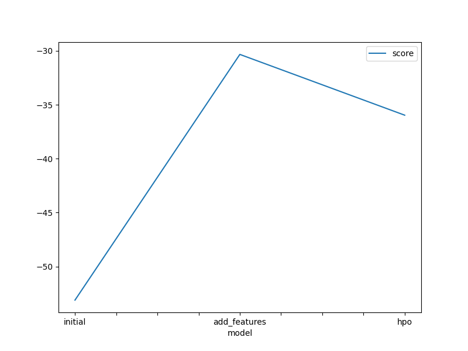
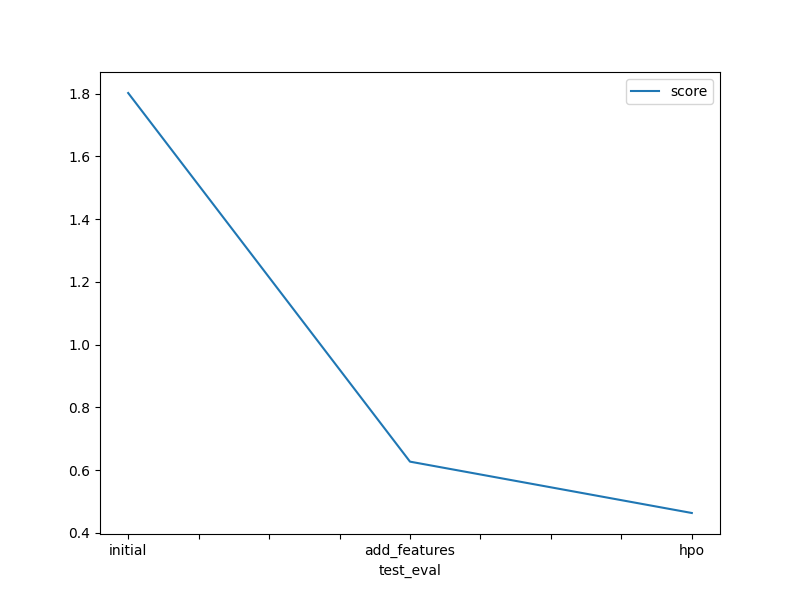

# Report: Predict Bike Sharing Demand with AutoGluon Solution

#### M Akshith

## Initial Training

### What did you realize when you tried to submit your predictions? What changes were needed to the output of the predictor to submit your results?

When I tried to submit my predictions, it is found that the predictions is a Series and it has only the target column('count' in this dataset). So, we need to use the sampleSubmission.csv provided to us in the datasets and change the column of target label with our prediction values.

### What was the top ranked model that performed?

The top ranked model was the "WeightedEnsemble_L3"

## Exploratory data analysis and feature creation

### What did the exploratory analysis find and how did you add additional features?

In Exploratory Data Analysis (EDA), it is found that the datatime columns has lots of data in one column, that is, the data of years, months, etc., is present in the single feature and also some datatypes are string which can be changed into categorical data.
Here, we created new features like year, month etc from the datatime feature and added it to our DataFrame. We also converted few string datatypes to category datatype.

### How much better did your model preform after adding additional features and why do you think that is?

There is a drastic change in the performance of the model after adding additional_features. The intial score before adding new features was 1.80196 and after adding new features, it was 0.62716. It was almost three times better than the initial model.
I think, adding additional features improved the performance of the model because these new features added in the dataset add new information in the learning process of the model and hence increasing the performance.

## Hyper parameter tuning

### How much better did your model preform after trying different hyper parameters?

The score of the model after trying different hyper parameters is even much better. The new score now is 0.4635. This is better than the 'add_features' model and 'initial' model which had the scores of 0.2716 and 1.80916 respectively.

### If you were given more time with this dataset, where do you think you would spend more time?

If I was given more time with this dataset, I you would spend more time on Exploratory Data Analysis (EDA) and try to make the data as best as the possible for the model to give the best performance. Feature Engineering is a noticle task in this processing. I may try to change few other datatypes, normalize the data, etc.

### Create a table with the models you ran, the hyperparameters modified, and the kaggle score.

| model        | time_limit (sec) | GBM.num_boost_round | NN_TORCH.num_epochs | score   |
| :----------- | :--------------- | :------------------ | :------------------ | :------ |
| initial      | 600              | 100                 | 10                  | 1.80196 |
| add_features | 600              | 100                 | 10                  | 0.62716 |
| hpo          | 700              | 150                 | 8                   | 0.46350 |

### Create a line plot showing the top model score for the three (or more) training runs during the project.

### Create a line plot showing the top kaggle score for the three (or more) prediction submissions during the project.

## Summary

In conclusion, it can be found that in very less time with just a few changes, we got a good scores with 'add_features' and the 'hpo' model compared to the 'initial' model. AutoGluon is very good to go model to get better performance in less time. So, if we spend more time on EDA part and then take time to find the best set of hyperparameters then we get amazing results by our model. This brings the major work in the field of research in Machine Learning.

Here, we can conclude that the model with the hyperparameter optimization performed the best. The main hyperparameter affecting the change here would be is increasing the time_limit for the hpo model and also changing the number of epochs in the Neural Network Model, increasing the num_boost_round in the GBM model.
